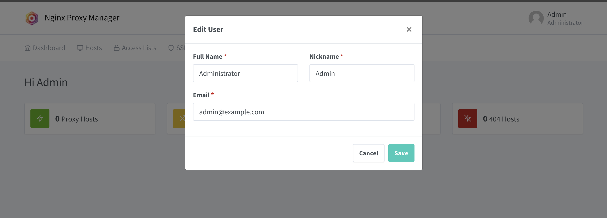
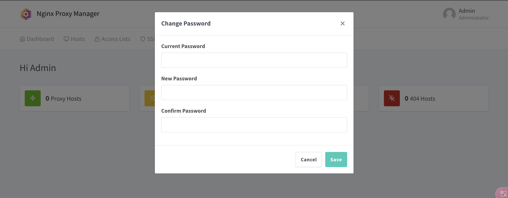
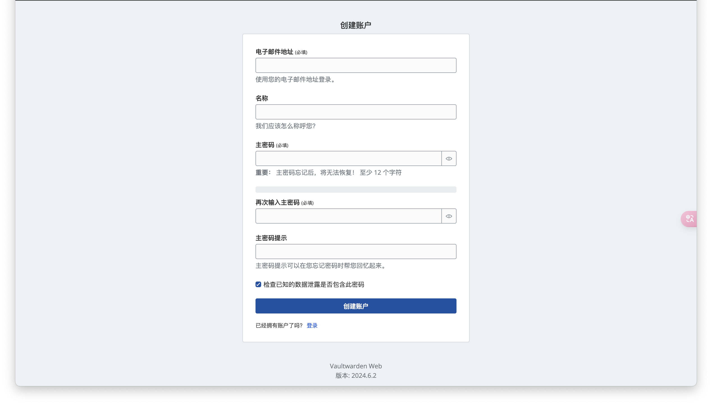


几天前我发现我的微软帐号被人撞库成功，幸好开了两步认证，于是乎我马上修改密码；我跟我朋友分享了此事，他让我搭个密码管理库以防自己忘记密码，而且 **Bitwarden** 支持生成随机密码，大大提高密码的安全性


那么就在此介绍我是如何搭建个人密码管理器的

### 什么是 Bitwarden 和 Vaultwarden
[Vaultwarden](https://github.com/dani-garcia/vaultwarden) 是用 Rust 编写的非官方 Bitwarden 兼容服务器

[Bitwarden](https://bitwarden.com/products/) 可帮助您安全可靠地生成、保存和管理登录信息。您还可以与组织中的其他人轻松共享安全信息。

我们的目的是搭建第三方的 Bitwarden `服务器` 即 Vaultwarden ，使用Bitwarden将我们的密码存放到此 Vaultwarden 服务器

### 安装 Vaultwarden 服务端
ssh连接到vps，创建 Vaultwarden 目录
```bash
mkdir vaultwarden -p
cd vaultwarden
```
创建并编辑 docker-compose.yml 文件
```yml
version: '3.9'
services:
  vaultwarden:
    image: 'vaultwarden/server:latest'
    restart: unless-stopped
    volumes:
       - './vw-data/:/data/'
    container_name: vaultwarden
    ports:
       - 80:80
```
```bash
docker compose up -d
```
#### 安装 nginx proxy manager
>     在此之前，由于 vaultwarden 的安全要求不允许 http 访问
>     让我们来使用 nginx proxy manager 来反向代理 vaultwarden 服务吧
>     同样使用 docker 来部署
```bash
cd ~
mkdir nginx_proxy_manager
cd nginx_proxy_manager
vim docker-compose.yml
```
```yml
#docker-compose.yml
version: "3"
services:
  app:
    image: 'jc21/nginx-proxy-manager:latest'
    container_name: npm_app
    restart: unless-stopped
    ports:
      # These ports are in format <host-port>:<container-port>
      - '80:80' # Public HTTP Port
      - '443:443' # Public HTTPS Port
      - '81:81' # 管理端口，修改为自己的
      # Add any other Stream port you want to expose
      # - '21:21' # FTP
    environment:
      DB_MYSQL_HOST: "db"
      DB_MYSQL_PORT: 3306
      DB_MYSQL_USER: "npm"         # 数据库用户名
      DB_MYSQL_PASSWORD: "npm"     # 数据库密码
      DB_MYSQL_NAME: "npm"         # 数据库名称
      # Uncomment this if IPv6 is not enabled on your host
      # DISABLE_IPV6: 'true'
    volumes:
      - ./data:/data
      - ./letsencrypt:/etc/letsencrypt
    depends_on:
      - db
    logging:
      driver: "json-file"          # 限制log文件
      options:
        max-size: "100M"           # 限制log文件大小
    networks:
      - npm
  db:
    image: 'jc21/mariadb-aria:latest'
    restart: unless-stopped
    environment:
      MYSQL_ROOT_PASSWORD: 'npm'   # 数据库ROOT密码
      MYSQL_DATABASE: 'npm'        # 数据库名称
      MYSQL_USER: 'npm'            # 数据库用户名
      MYSQL_PASSWORD: 'npm'        # 数据库密码
    volumes:
      - ./mysql:/var/lib/mysql
    networks:
      - npm

networks:                           # 连接外部网络，方便内部代理
  npm:
    external: true
```
```bash
docker network create npm
```
修改一下 vaultwarden **docker-compose.yml** 文件把端口改成8080
```yml
version: '3.9'
services:
  vaultwarden:
    image: 'vaultwarden/server:latest'
    restart: unless-stopped
    volumes:
       - './vw-data/:/data/'
    container_name: vaultwarden
    ports:
       - 8080:80
```
```bash
cd ~/nginx_proxy_manager
docker compose up -d
cd ~/vaultwarden
docker compose up -d
```
#### 设置反向代理
浏览器输入 **IP地址:81** 进入npm设置，第一次登录使用默认用户&密码，然后设置管理员密码
```bash
Email:    admin@example.com
Password: changeme
```

此处Email可填写不存在的地址(只用作登录用途)

修改密码后设置代理服务


- Domain Names：反向代理的域名，输入域名后按回车确认(该域名解析是本机公网ip)。
- Forward Hostname / IP：填写代理的ip(为方便填写docker0网卡IP也可)。
- Forward Port：反向代理的端口，这里就是8080。
- Cache Assets：启用缓存。
- Block Common Exploits：阻止一些常见漏洞。
- Websockets Spport：支持Websockets。
- Access List：配合多账户使用，选择权限范围。


申请一个证书
- SSL Certificate：选择证书，Request a new SSL Certificate使用当前域名申请新证书。
- Force SSL：强制使用SSL。
- HTTP/2 Support：支持HTTP/2协议标准。
- HSTS Enabled：使用HSTS策略机制，有助于保护网站免受中间人攻击。
- HSTS Subdomains：子域名适用
- Use a DNS Challenge：使用域名解析商方案。
- Email Address for Let’s Encrypt：申请Let's Encrypt证书使用的电子邮箱。
- I Agree to the Let’s Encrypt Terms of Service：同意Let's Encrypt服务

点击save


浏览器输入 **域名** 进行简单的配置，点击下方**创建用户**

此处`电子邮件地址`随便填写即可(单纯登录用途)，也可以填写真实的地址；
然后设置登录密码，登录


至此服务端建立完毕，接下来客户端如何接入

### 客户端接入
根据平台先下载 [客户端](https://bitwarden.com/download/)

各平台接入方式大同小异，无非就是选择自托管服务器也就是我们刚刚搭建的非官方 Bitwarden 兼容服务器，设置服务器URL为反向代理的域名即可
### 最后
Bitwarden 可以将你的密码保存到你的服务器里，自身也是一个密码生成工具，同样Chrome也支持该插件，终于摆脱忘记密码的烦恼了呼呼！！